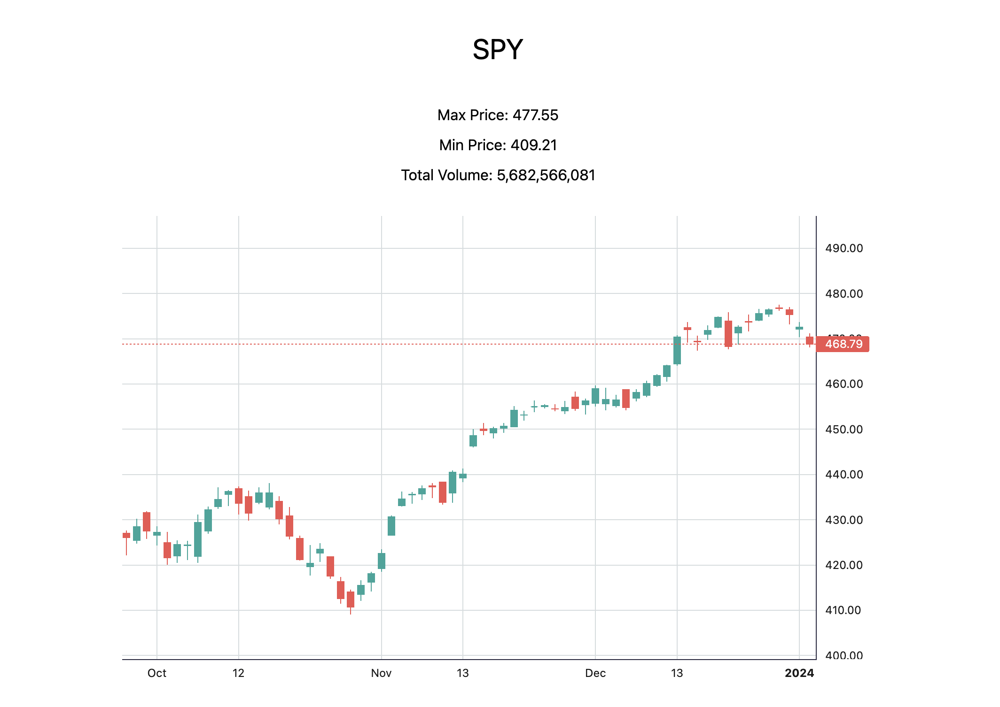

## Alpaca with Lightweight Charts

This is a simple implementation of [Alpaca's marketdata API](https://pkg.go.dev/github.com/alpacahq/alpaca-trade-api-go/v3/marketdata) using TradingView's [lightweight charts](https://tradingview.github.io/lightweight-charts/docs) to display the chart. It uses [Go's html/template package](https://pkg.go.dev/html/template) to render the data with [tailwind](https://tailwindcss.com/) for some styling.

It takes two parameters to pass through to the market data API, a `ticker` and a `days`, for the number of days to look back. If the latter is not specified, it defaults to 90 days. `ticker` is required, and it uses a one day time frame.

### Usage
You will need an API key and secret from [Alpaca](https://alpaca.markets/) to query the API. Run the server after exporting your API key and secret:
```bash
export APCA_API_KEY_ID=<your API key>
export APCA_API_SECRET_KEY=<your API secret>
go run .
```

Open [http://localhost:8090/chart?ticker=SPY&days=120](http://localhost:8090/bars?ticker=SPY&days=120) (or replace the ticker with whatever valid symbol you want) with your browser to see the result. It should look something like this:


